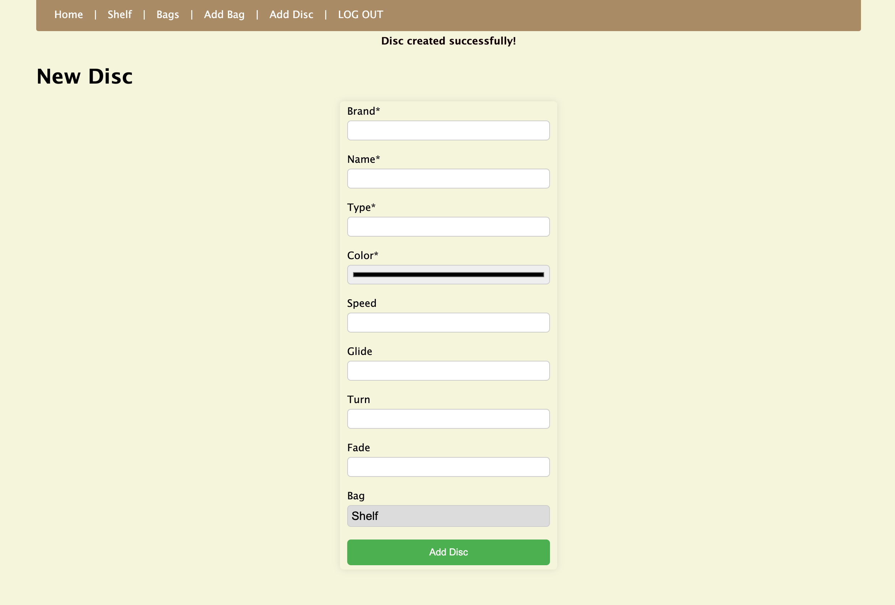

# Disc Golf Manager
A disc golf inventory app that allows you to keep track of your bags and discs. When I am playing I can never remember which discs I have in my bag and what their flight numbers are. This app will allow you to keep track of all of that information. I made sure to design a layout that worked with mobile since it will be used mostly when out on the course.

# Screenshot

# Technologies Used

- JavaScript
- HTML
- CSS
- Express

# Getting Started

(your deployment url here)

# Next Steps

- Adding the ability to set a disc to lost and have it hidden from your bag until found
- 